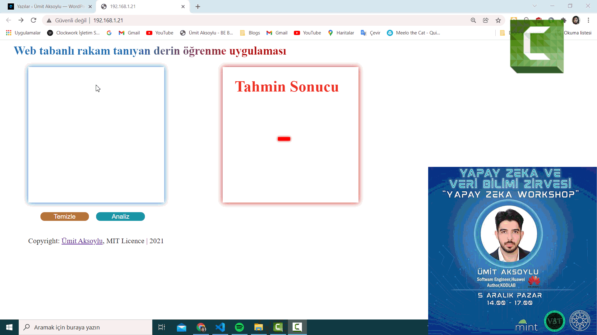

# Web-based Shape Recognition Deep Learning Application (YTU NEURAL NETS)

I did this project at the workshop he attended as a speaker. In fact, we did it together.
At the workshop that I attended with the invitation of Yıldız Technical University Mint Club and data science community, we held an event that lasted three hours with over 150+ people. 
We have created this project together with the live coding event.

## Dependencies 
You have to install followed libraries with your command line and pip:
- pip install flask
- pip install Flask-Cors
- pip install tensorflow
- pip install keras
- pip install numpy
- pip install pandas
- pip install opencv-python

## How to use ?

- For training model, run 
`python train.py`
command on your CLI
- For predicting images with trained model, run
`python predict.py`
command on your CLI

- There is already a pretrained model exist. So, you can directly start your web app by running
`python server.py`
command on your CLI

## Thanks to all attendees & collaborators

- @alihepi
- @asliakaltunn
- @ayhangider
- @aysftmzhrgl
- @bariscanbilgin
- @baristokatlioglu
- @Besteozulku
- @bestoz
- @ceyda1307
- @cmelisa
- @csenaesenboga
- @demirelmrtcn
- @dryzrc
- @duxeph
- @eminesozeri
- @hediyeorhan
- @HuseyinEfkanAlp
- @Logenzo
- @melikecbkc
- @NihalDiler
- @selvataas
- @tugceyaziicii
- @virosapienti
- @yeyosef

if i forgot your name but you was attended to my workshop, please mail me <umit@aksoylu.space> so i can add your name
